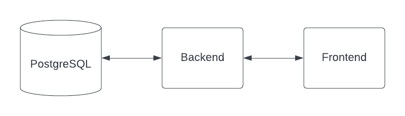

# Pre-Test Bootcamp fullstack developer

## Task 1 (Virtualization)

- Buatlah sebuah VM dengan kententuan
  - username: `<github_user>` contoh `dimasm93`
  - hostname: `<email_without_at>` contoh `dimas.tabeldata.com`
  - OS: `ubuntu-20.04` atau `centos-7`
- Install webserver `nginx`
  - Configurasi reverse-proxy ke alamat `https://jsonplaceholder.typicode.com/todos/1` dengan url `/todo`
  - Lakukan curl ke alamat tersebut contoh `<ip-vm-host>:<ip-vm-port-nginx>/todo` (kirimkan hasil screenshotnya simpan dalam folder `screenshot` dengan nama `task1.png`)

## Task 2 (Container)

Jika saya memiliki architecture seperti berikut:

Dimana berikut adalah configurasi docker image:

1. Backend container
  - image: `dimmaryanto93/udemy-springboot-app:latest`
  - port: `8080`
  - env: 
    - `DATABASE_HOST`: `<ip-domain-db>`
    - `DATABASE_PORT`: `5432` 
    - `DATABASE_NAME`: `<db-name>`
    - `DATABASE_PASSWORD`: `<db-password>`
  need:
    - Database PostgreSQL v14.2
2. Frontend container
  - image: `dimmaryanto93/udemy-angular-app:latest`
  - port: `80`
  - env:
    - `APPLICATION_PORT`: `14.15-alpine`
    - `NGINX_ROOT_DOCUMENT`: `/var/www/html`
    - `BACKEND_HOST`: `<ip-backend-apps>`
    - `BACKEND_PORT`: `<port-backend-apps>`
    - `BACKEND_CONTEXT_PATH`: `/`
  - need:
    - Backend container

Silahkan buat docker-compose filenya, kemudian simpan dalam folder `tasks` dengan nama `docker-compose.yaml`

## Task 3 (Orchestration Container System)

1. Apa yang anda ketahui tentang Orchestration Container System?
2. Kenapa Orchestration Container System seperti Kubernetes sangat popular (menurut anda)?

Cara pengerjaan, silahkan update file ini tulis jawabanya di bawah ini
